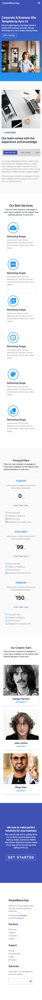
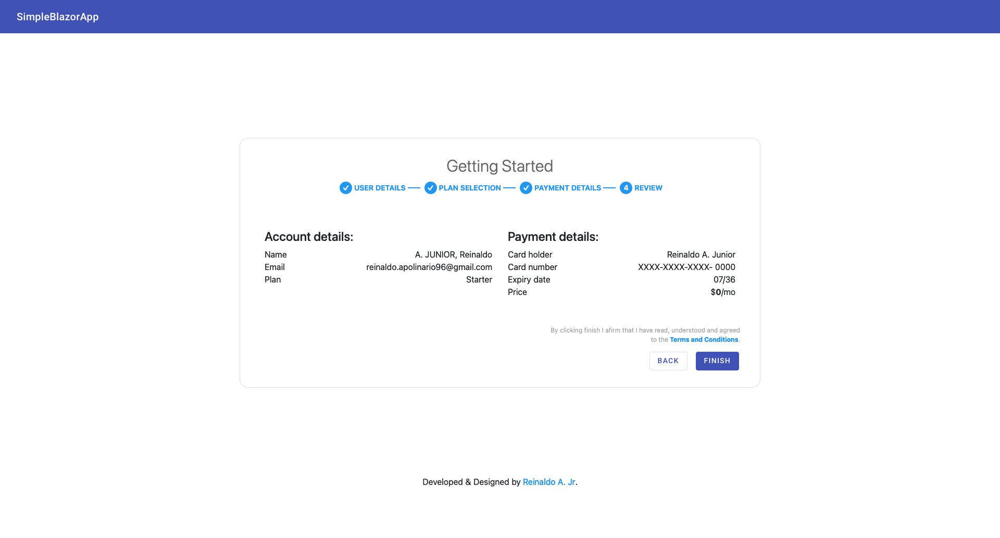

# Simple Blazor App
A simple Blazor App with a Landing Page and an Administration Dashboard to be used alongside with, and as a frontend to, the [Simple Dot Net API](https://github.com/juni127/simple-dot-net-api). Therefore, the app goal is to provide a interface for users to buy the aforementioned API subscription and manage their usage of it.

To facilitate the development, the [MatBlazor](https://www.matblazor.com) component library was used.

## Index
1. [Running & Testing](#running--testing)
    1. [With Docker](#with-docker)
    2. [Without Docker](#without-docker)
2. [Images](#images)
    1. [Landing page desktop](#landing-page-desktop)
    2. [Landing page mobile](#landing-page-mobile)
    3. [Register desktop]()
    4. [Register mobile]()
3. [Landing page](#landing-page)
    1. [Sections](#sections)
    2. [Register](#register)
4. [Dashboard](#dashboard)
5. [TODO](#todo)

## Running & Testing
This app was written using a Docker container environment and as such the "Running Without Docker" may not be 100% accurate.

### Testing with Docker
Bellow is a list with the steps to run this app using Microsoft's .NET SDK Docker image from CLI, allowing live edition.

1. Follow this [tutorial](https://docs.docker.com/engine/install/ubuntu/) to install Docker (and Docker Compose) on your machine.
2. On the base directory of the project run: `docker compose up test`.
3. Open the app on [http://localhost:5123](http://localhost:5123).

### Running with Docker[^1]
Bellow is a list with the steps to build and run this app using Microsoft's .NET Runtime Docker image from CLI.

1. Follow this [tutorial](https://docs.docker.com/engine/install/ubuntu/) to install Docker (and Docker Compose) on your machine.
2. On the base directory of the project run: `docker compose up publish`.
3. Open the app on [http://localhost](http://localhost).

[^1]: Please note that the [publishing errors](#todo) have not been fixed yet.

### Without Docker
To be written...

## Images
In case you're in a hurry or just want to see what the app looks like before running it, there are some screenshots in this section. These prints were taken using *Firefox Developer Edition 117.0b9 (64-bits)* under *macOS Monterey 12.6.2*.

### Landing page desktop

### Lading page mobile

### Register desktop

### Register mobile[^2]

[^2]: This section is a placeholder for the screenshots of the Register page on mobile since there is a need to fix the former's responsiveness.

## Landing page
This part of the app was created to serve as a starting point for user interaction and the marketing, registration, and selling interfaces. 

### Sections
The Sections page was implemented as an example, inspired by AyroUI's [Business Template](https://demo.ayroui.com/templates/business-template). The aim was to showcase the developer's ability to deliver a functioning UI based on a predefined design.  
To recreate this interface using Blazor this page was divided into sections, and a Section component was developed to encapsulate each bit. Then each of these pieces was implemented using Blazor's Scoped CSS to style each Section and the logic was implemented in their correspondent component classes, using JS when necessary.

### Register
The Register page was implemented to allow the simulation of new users' registration by contracting the application services.  
The process was divided into four sections: User details, Plan selection, Payment details and Review. This choice was made to add a degree of fidelity to the user experience as it corresponds to what would be commonly seen in the market.

As the contraction part of this page depends on the completion of certain [Simple Dot Net API](https://github.com/juni127/simple-dot-net-api) features that are not yet complete, there is only an interface with no functionality attached beyond some frontend field validation.

## Dashboard
The Dashboard section is currently under development.

## TODO
- [x] Docker configuration
    - [x] Implement testing service in docker-compose.yml.
    - [x] Create a Dockerfile for publishing the app.
    - [x] Implement publishing service in docker-compose.yml.
- [ ] README.md
    - [ ] Write Running & Testing section
        - [x] Write With Docker subsection
        - [ ] Write Without Docker subsection
    - [ ] Print and incorporate the Register Mobile subsection
- [x] Landing page
    - [x] Minimal layout
    - [x] Sections
        - [x] Section component
        - [x] Hero banner section
        - [x] Our story section
        - [x] Our services section
        - [x] Pricing section
        - [x] Our team section
        - [x] Call to action section
        - [x] Footer section
    - [ ] Register
        - [x] User details
        - [x] Plan selection
        - [x] Payment details
        - [x] Review
        - [ ] Fix mobile
    - [ ] Remove all inline CSS
- [ ] Dashboard
    - [x] Main layout
    - [ ] Drawer menu
    - [ ] Modules
- [ ] [Simple Dot Net API](https://github.com/juni127/simple-dot-net-api) integration
    - [ ] Create .env file to hold API information
    - [ ] Create a service to handle calls to the API
    - [ ] Implement a custom IdentityManager
- [ ] Fix warnings
- [x] Fix static file errors when publishing